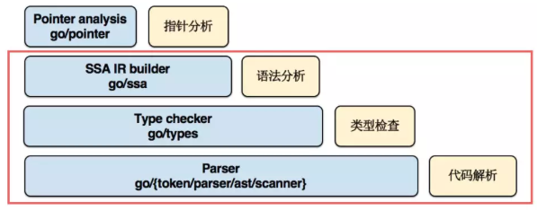
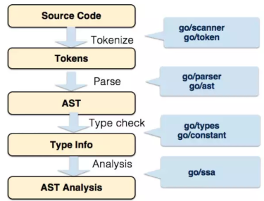

# Code Analysis

## [代码分析驱动代码质量](https://blog.csdn.net/RA681t58CJxsgCkJ31/article/details/82782895)
```md
词法分析
语法分析
语义分析
控制流分析
数据流分析
```
## 代码分析方向
```md
规约扫描 规约是历史错误经验的总结，衡量代码与集团规约扫描的符合程度
重复度 重复代码越多，代码越难维护，修改代码所带来的风险越高
复杂度 单元（方法或类）复杂度越高，代码越难维护，出现故障的可能性越高
面向对象 面向对象设计的好坏，是软件是否容易维护的重要影响因素
```

### 代码分析流程


#### 代码的解析


#### 类型的检查

#### 语法的检查

## 工具
### [RefDiff - 是一个在git存储库的提交历史中挖掘重构的工具。目前支持：Java，JavaScript和C](https://github.com/aserg-ufmg/RefDiff?spm=ata.13261165.0.0.317a3aedtovoYl)


