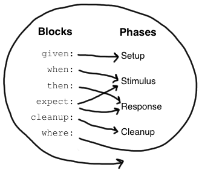
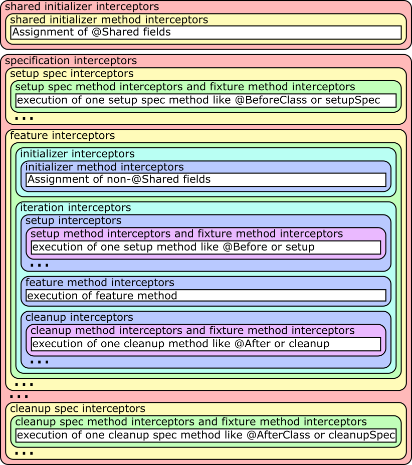

# [Spock Framework Reference Documentation](http://spockframework.github.io/spock/docs)
```
Peter Niederwieser, Leonard Brünings, The Spock Framework Team Version 1.3
```

Table of Contents
=================

   * [<a href="http://spockframework.github.io/spock/docs" rel="nofollow">Spock Framework Reference Documentation</a>](#spock-framework-reference-documentation)
   * [Table of Contents](#table-of-contents)
      * [Introduction 【Spock 介绍】](#introduction-spock-介绍)
      * [Getting Started](#getting-started)
         * [Spock Web Console【Spock 在线控制台】](#spock-web-consolespock-在线控制台)
         * [Spock Example Project【Spock 样例工程】](#spock-example-project-spock-样例工程)
      * [Spock Primer [Spock 进阶]](#spock-primer-spock-进阶)
         * [Terminology 术语](#terminology-术语)
         * [Imports 导入](#imports-导入)
         * [Specification](#specification)
         * [Fields](#fields)
         * [Fixture Methods](#fixture-methods)
            * [Invocation Order](#invocation-order)
         * [Feature Methods](#feature-methods)
            * [Blocks](#blocks)
         * [Helper Methods](#helper-methods)
         * [Using with for expectations](#using-with-for-expectations)
         * [Using verifyAll to assert multiple expectations together](#using-verifyall-to-assert-multiple-expectations-together)
         * [Specifications as Documentation](#specifications-as-documentation)
         * [Extensions](#extensions)
         * [Comparison to JUnit](#comparison-to-junit)
      * [Data Driven Testing 数据驱动测试](#data-driven-testing-数据驱动测试)
         * [Introduction](#introduction)
         * [Data Tables 数据表格](#data-tables-数据表格)
         * [Isolated Execution of Iterations](#isolated-execution-of-iterations)
         * [Sharing of Objects between Iterations](#sharing-of-objects-between-iterations)
         * [Syntactic Variations](#syntactic-variations)
         * [Reporting of Failures](#reporting-of-failures)
         * [Method Unrolling](#method-unrolling)
         * [Data Pipes](#data-pipes)
         * [Multi-Variable Data Pipes](#multi-variable-data-pipes)
         * [Data Variable Assignment](#data-variable-assignment)
         * [Combining Data Tables, Data Pipes, and Variable Assignments](#combining-data-tables-data-pipes-and-variable-assignments)
         * [Number of Iterations](#number-of-iterations)
         * [Closing of Data Providers](#closing-of-data-providers)
         * [More on Unrolled Method Names](#more-on-unrolled-method-names)
      * [Interaction Based Testing 基于交互的测试](#interaction-based-testing-基于交互的测试)
         * [Creating Mock Objects 创建Mock对象](#creating-mock-objects-创建mock对象)
         * [Default Behavior of Mock Objects](#default-behavior-of-mock-objects)
         * [Injecting Mock Objects into Code Under Specification](#injecting-mock-objects-into-code-under-specification)
         * [Mocking](#mocking)
            * [Interactions](#interactions)
            * [Cardinality](#cardinality)
            * [Target Constraint](#target-constraint)
            * [Method Constraint](#method-constraint)
            * [Argument Constraints](#argument-constraints)
            * [Matching Any Method Call](#matching-any-method-call)
            * [Strict Mocking](#strict-mocking)
            * [Where to Declare Interactions](#where-to-declare-interactions)
            * [Declaring Interactions at Mock Creation Time](#declaring-interactions-at-mock-creation-time)
            * [Grouping Interactions with Same Target](#grouping-interactions-with-same-target)
            * [Mixing Interactions and Conditions](#mixing-interactions-and-conditions)
            * [Explicit Interaction Blocks](#explicit-interaction-blocks)
            * [Scope of Interactions](#scope-of-interactions)
            * [Verification of Interactions](#verification-of-interactions)
            * [Invocation Order](#invocation-order-1)
            * [Mocking Classes](#mocking-classes)
         * [Stubbing](#stubbing)
            * [Returning Fixed Values](#returning-fixed-values)
            * [Returning Sequences of Values](#returning-sequences-of-values)
            * [Computing Return Values](#computing-return-values)
            * [Performing Side Effects](#performing-side-effects)
            * [Chaining Method Responses](#chaining-method-responses)
         * [Combining Mocking and Stubbing](#combining-mocking-and-stubbing)
         * [Other Kinds of Mock Objects](#other-kinds-of-mock-objects)
            * [Stubs](#stubs)
            * [Spies](#spies)
            * [Partial Mocks](#partial-mocks)
         * [Groovy Mocks](#groovy-mocks)
            * [Mocking Dynamic Methods](#mocking-dynamic-methods)
            * [Mocking All Instances of a Type](#mocking-all-instances-of-a-type)
            * [Mocking Constructors](#mocking-constructors)
            * [Mocking Static Methods](#mocking-static-methods)
         * [Advanced Features](#advanced-features)
            * [A la Carte Mocks](#a-la-carte-mocks)
            * [Detecting Mock Objects](#detecting-mock-objects)
         * [Further Reading](#further-reading)
      * [Extensions](#extensions-1)
         * [Spock Configuration File](#spock-configuration-file)
         * [Built-In Extensions](#built-in-extensions)
         * [Third-Party Extensions](#third-party-extensions)
         * [Writing Custom Extensions](#writing-custom-extensions)
      * [Modules](#modules)
         * [Guice Module](#guice-module)
         * [Spring Module](#spring-module)
         * [Tapestry Module](#tapestry-module)
         * [Unitils Module](#unitils-module)
         * [Grails Module](#grails-module)
      * [Release Notes](#release-notes)
      * [Migration Guide](#migration-guide)

## Introduction 【Spock 介绍】
Spock 是运用于 Java and Groovy 应用程序的测试框架。
它美丽而富有表现力的规范说明语言使得它从众多的测试框架中脱颖而出。
由于基于JUnit执行器，使得Spock与大多数IDE，构建工具和持续集成服务器保持兼容。
Spock的灵感来自JUnit，jMock，RSpec，Groovy，Scala，Vulcans 和其他一些优秀的框架。

## Getting Started
这部分会展示 Spock 如何起步，可以说是比较简单的。

### Spock Web Console【Spock 在线控制台】
[Spock Web Console](http://meetspock.appspot.com/) 是一个在线 查看、编辑、运行、发布 Spock 测试脚本的网站，
它是一个不用做任何付出就能玩转Spock的完美场所。
所以赶紧去运行一下 [“Hello, Spock!” ](http://meetspock.appspot.com/edit/9001)吧！

### Spock Example Project【Spock 样例工程】
如果想在本地环境尝试 Spock，可以从 GitHub 下载[ “ Spock Example Project”](https://github.com/spockframework/spock-example)，
它无需你做任何的设置，就可用使用 Ant，Gradle和Maven运行。
使用一个简单的命令就可以使用Gradle启动或者在Eclipse和IDEA中运行。具体可以查看README文件中的详细介绍.

## Spock Primer [Spock 进阶]
本章假定你有一定的 Groovy 和 单元测试 基础。
如果你是一个Java开发者而没有听说过 Groovy，别担心 —— 你会觉得 Groovy 十分熟悉。
事实上，Groovy一个主要的设计目标就是成为与Java兼容的脚本语言。
只要你查阅下 [Groovy 官方文档](http://groovy-lang.org/documentation.html)，你就会喜欢上它。

本章的目标是教会你编写一些真实的 Spock 描述脚本（specification），并激起你更大的兴趣。

参考： 

[Groovy](http://groovy-lang.org/) 

[单元测试](http://en.wikipedia.org/wiki/Unit_testing)

### Terminology 术语
首先让我们来做一些定义：Spock 让你编写 描述性脚本 来描述 某个被测系统的期望功能（属性、性质）。
被测系统可以是一个类或一个应用，也被称为 基于描述的系统（system under specification or SUS）。
对于一个功能的描述从SUS及其协作者的特定快照开始;此快照被称为这个功能的 fixture。

以下部分将引导你完成可能组成Spock描述脚本的所有构建块。典型描述性脚本一般仅使用它们的子集。

### Imports 导入
```java
import spock.lang.*
```
包 spock.lang 包含了编写描述性脚本的大部分重要的类。

### Specification
```groovy
class MyFirstSpecification extends Specification {
  // fields
  // fixture methods
  // feature methods
  // helper methods
}
```
一个测试描述对应于一个 Groovy 类，这个类必须继承 spock.lang.Specification。
测试描述的按照它所描述的功能来命名。
例如：CustomerSpec, H264VideoPlayback, and ASpaceshipAttackedFromTwoSides，
对于一个测试描述这些都是合理的命名。

测试描述类通常包含许多对于编写描述性脚本有用的方法，同时它也指明了 JUnit 如何 Sputnik 来运行描述性脚本。
Sputnik 使得 Spock specifications 可以运行于 大多数现代 Java 集成开发环境 和 构建工具。
### Fields
```groovy
def obj = new ClassUnderSpecification()
def coll = new Collaborator()
```

```groovy
@Shared res = new VeryExpensiveResource()
```
有时你可能需要在几个功能方法之间共享对象。
例如，对象创建很昂贵时，或者你需要功能方法之间有交互。这时可以使用 @Shared 标记字段。
最好能在定义字段的同时初始化。（从语义上讲，这相当于在setupSpec（）方法的最开始初始化字段。）

```groovy
static final PI = 3.141592654
```
静态字段应用只用于常量，共享字段是最优的选择，因为他们对共享语法的定义更明确。

### Fixture Methods
```groovy
def setupSpec() {}    // runs once -  before the first feature method
def setup() {}        // runs before every feature method
def cleanup() {}      // runs after every feature method
def cleanupSpec() {}  // runs once -  after the last feature method
```
固定方法（Fixture Methods）负责配置或清除测试环境。
通常最好为每个功能方法都增加 setup() and cleanup() 固定方法。

所有的固定方法都是可选的。

有时候，多个功能方法共享一个 Fixture 是有意义的，通过共享字段和setupSpec()、cleanupSpec() 方法的结合来实现。
注意，setupSpec() 和 cleanupSpec() 方法中不能引用实例字段，除它们非被 @Shared 标记。

#### Invocation Order
如果在子类中重写了 setUp()方法，父类的setup（）将在子类的setup（）之前运行。
而 cleanup() 则是相反的，子类cleanup()将先执行。
setupSpec() 和 setUp()一致，cleanupSpec()和cleanup()一致。
不需要显式调用super.setup（）或super.cleanup（），因为Spock将默认会按照继承的层次结构查找和执行fixture方法。

调用顺序：
super.setupSpec
sub.setupSpec
super.setup
sub.setup
feature method
sub.cleanup
super.cleanup
sub.cleanupSpec
super.cleanupSpec

### Feature Methods
```groovy
def "pushing an element on the stack"() {
  // blocks go here (块结构)
}
```
Feature methods 是 specification 的核心。它描述了你期望的系统功能，一般情况下用一个字符串来命名。
可以使用你喜欢的任意字符为 Feature methods 取一个最合适的名字。

从概念上讲，一种 Feature method 包括四个阶段：
1. Set up
2. 为被测对象提供一个激励（stimulus）
3. 描述期望的响应
4. Clean up

第一个和第四个阶段是可选的，除非是在交互式Feature Method中，否则第二、三个阶段一般都存在，并且有可能出现不止一次。

#### Blocks 
Spock 内置支持 Feature method 的每个阶段。为此，Feature method 被结构化为 多个块结构。
块结构以一个标签开始，并延伸到下一个块结构开始或方法的结尾。
有6种块结构：
given, when, then, expect, cleanup, where
方法开头和第一个显式块之间的任何语句都属于隐式 given 块。

Feature method 必须至少有一个显式（即标记）块。
实际上，显式块的存在才使得一个方法成为 feature method。块将方法划分为不同的部分，并且不能嵌套。

 

上图展示了块 和 各个 概率阶段 的映射，where 块比较特别，后续你会看到，我们先来详细了解下其他块。

* Given Blocks (given 块结构)
```groovy
given:
def stack = new Stack()
def elem = "push me"
```
given块 是为要描述的功能进行设置的地方。在它之前可能没有其它块，也可能不会重复。
given块 没有任何特殊的语义。
given: 标志可以省略，从而产生一个隐式的given块。
期初，别名 setup:是首选的块名称，但是使用 given: 常常更能得到一个更可读的  Feature method 描述。
(参考 [Specifications as Documentation](#specifications-as-documentation))

* When and Then Blocks
```groovy
when:   // stimulus
then:   // response
```
when 和 then 块常常一起出现，它们描述了一个 stimulus 和一个期望的响应。
而when块可能包含任意代码时，then 块仅限于条件，异常条件，交互和变量定义。
一个 feature method 可能包含多组 when-then。

* Conditions
条件（Conditions ）描述一个期望的状态，比较像JUnit的断言。
但是，条件是作为普通布尔表达式编写的，不需要断言API。
（更确切地说，条件也可能产生非布尔值，然后根据Groovy真值进行评估。）
让我们看一些conditions的实例：
```groovy
when:
stack.push(elem)

then:
!stack.empty
stack.size() == 1
stack.peek() == elem
```
小建议 :
尽量保持每个Feature method的较少的条件。1-5个是一个很好的实践。
如果多于这个范围，问问自己是否一次指定了多个不相关的功能。如果是的，则需要对 feature method  进行分解。
如果你的条件仅在值上有所不同，请考虑使用[数据表](#data-tables-数据表格)。

如果违反条件，Spock会提供什么样的反馈？
让我们来尝试改变第二个条件为 stack.size() == 2，以下是结果：

```md
Condition not satisfied:

stack.size() == 2
|     |      |
|     1      false
[push me]
```
你会看到，在验证条件期间，Spock会捕获产生的所有值，并以易读的形式呈现它们。看起来很不错，是不是？

* * Implicit and explicit conditions 隐式和显式条件 

条件是then块和expect块的基本要素。
除了调用 void方法 和 被分类为交互的表达式 之外，这些块中的所有顶级表达式都被隐式地视为条件。
要在其他地方使用条件，需要使用Groovy的assert关键字指定它们：
```groovy
def setup() {
  stack = new Stack()
  assert stack.empty
}
```
如果一个显式条件被违反，它将产生与隐式条件相同的良好的诊断消息。

* * Exception Conditions 异常条件

异常条件用于描述when块应该抛出异常。它们使用thrown()方法定义，传入预期的异常类型。
例如，如果从空堆弹出元素，应该抛出 EmptyStackException，要描述这个场景，可以编写以下内容：
```groovy
when:
stack.pop()

then:
thrown(EmptyStackException)
stack.empty
```
你看到，异常条件可能会跟随其他条件（甚至其他块），这对于具体说明异常的预期内容特别有用。
要访问异常，首先将其绑定到变量：
```groovy
when:
stack.pop()

then:
def e = thrown(EmptyStackException)
e.cause == null
```
或者可以对上面的语法做一些改变：
```groovy
when:
stack.pop()

then:
EmptyStackException e = thrown()
e.cause == null
```
上面的语法有两个小优点：
首先，异常变量是强类型的，这使IDE更容易提供代码补全。
其次，条件语句读起来更像一个句子（'然后 一个 EmptyStackException 异常被抛出'）。
请注意，如果没有向thrown()方法传递异常类型，则从左侧的变量类型推断出它。

有时候我们需要传达不应该抛出异常，例如，让我们尝试表示HashMap应该接受一个空键：
```groovy
def "HashMap accepts null key"() {
  setup:
  def map = new HashMap()
  map.put(null, "elem")
}
```
以上的方法有效，但没有透露代码的意图。
Did someone just leave the building before he had finished implementing this method?
条件在哪里？实际上可以做的更好：
```groovy
def "HashMap accepts null key"() {
  given:
  def map = new HashMap()

  when:
  map.put(null, "elem")

  then:
  notThrown(NullPointerException)
}
```
通过使用 notThrown()，使得对 NullPointerException 异常不应该被抛出的描述更加清晰。
（根据Map.put()的契约，对于不支持 null 值作为键的map，这样描述条件是正确的做法。）[？？？]
然而，如果Map.put()抛出任何其他异常，该方法还是会失败。

* * Interactions

条件描述对象的状态，而交互则描述对象如何相互通信。
交互和基于交互的测试在单独的章节中描述，因此我们仅在此给出一个快速示例：
假设我们想要描述从发布者到其订阅者的事件流。
```groovy
def "events are published to all subscribers"() {
  given:
  def subscriber1 = Mock(Subscriber)
  def subscriber2 = Mock(Subscriber)
  def publisher = new Publisher()
  publisher.add(subscriber1)
  publisher.add(subscriber2)

  when:
  publisher.fire("event")

  then:
  1 * subscriber1.receive("event")
  1 * subscriber2.receive("event")
}
```

* Expect Blocks

expect块比 then 块更有限，因为它可能只包含条件和变量定义。
在单个表达式中描述 stimulus 和 预期响应 情况下，expect 块非常有用，它的表述会更自然。
例如，比较以下两次描述 Math.max() 方法：
```groovy
when:
def x = Math.max(1, 2)

then:
x == 2
```
```groovy
expect:
Math.max(1, 2) == 2
```
尽管两个代码片段在语义上是等效的，但第二种表述显然更合适。
作为指导原则，一般使用when-then来描述具有副作用的方法，而 expect 用来描述纯粹的功能方法。

```md
建议： 利用像any（）和every（）这样的 Groovy JDK 方法来创建更具表现力和简洁的条件。
```
* Cleanup Blocks

```groovy
given:
def file = new File("/some/path")
file.createNewFile()

// ...

cleanup:
file.delete()
```
cleanup 块后面只能有where块，并且可能不会重复。
和 cleanup 方法一样，它被用户释放 feature method 使用的任何资源。
即使 在 cleanup 块 前面的 某个 feature method 部分产生了异常，cleanup 块也会运行。
因此必须对 cleanup 块进行防御性编码，在最坏的情况下，它必须优雅地处理feature method中的
第一个语句抛出异常的情况，并且所有局部变量仍然具有其默认值。

```md
提示：Groovy的安全解除引用运算符（foo？.bar（））简化了编写防御性代码的过程。
```

对象级 specifications 通常不需要清理方法，因为它们使用的唯一资源是内存，它由垃圾收集器自动回收。
但是，更粗粒度的 specifications 可能会使用clean块来清理文件系统，关闭数据库连接或关闭网络服务。

```md
如果规范的设计方式使其所有要素方法都需要相同的资源，请使用cleanup（）方法;否则，更喜欢清理块。
相同的权衡适用于setup（）方法和给定的块。
```

* Where Blocks

where块 始终位于方法的最后，并且可能不会重复。它用于编写数据驱动的特征方法。
为了让你了解如何完成此操作，请查看以下示例：
```groovy
def "computing the maximum of two numbers"() {
  expect:
  Math.max(a, b) == c

  where:
  a << [5, 3]
  b << [1, 9]
  c << [5, 9]
}
```
这个 where块 有效地创建了 feature method 的两个“版本”：一个是a是5，b是1，c是5，另一个a是3，b是9，c是9。
虽然 where块 是在最后声明的，但是是在包含它的 feature method 运行之前评估的。
where块 会在数据驱动测试章节中进一步说明。

### Helper Methods

有时，feature method 会变大而包含大量重复代码。在这种情况下，引入一个或多个辅助方法是有意义的。
辅助方法的两个好选择是 setup/cleanup 逻辑 和 复杂条件。前者比较简单，让我们来看看复杂条件：
```groovy
def "offered PC matches preferred configuration"() {
  when:
  def pc = shop.buyPc()

  then:
  pc.vendor == "Sunny"
  pc.clockRate >= 2333
  pc.ram >= 4096
  pc.os == "Linux"
}
```
如果你恰好是计算机爱好者，你喜欢的PC配置可能非常详细，或者你可能想要比较来自许多不同商店的优惠。
因此，让我们分解出条件：
```groovy
def "offered PC matches preferred configuration"() {
  when:
  def pc = shop.buyPc()

  then:
  matchesPreferredConfiguration(pc)
}

def matchesPreferredConfiguration(pc) {
  pc.vendor == "Sunny"
  && pc.clockRate >= 2333
  && pc.ram >= 4096
  && pc.os == "Linux"
}
```
新的辅助方法 matchesPreferredConfiguration（）返回一个布尔表达式的结果。(return 关键字在Groovy中是可选的。)
这很好，除了给出的结果不够明确：
```md
Condition not satisfied:

matchesPreferredConfiguration(pc)
|                             |
false 
```
这不是很有帮助。幸运的是，我们可以做得更好：
```groovy
void matchesPreferredConfiguration(pc) {
  assert pc.vendor == "Sunny"
  assert pc.clockRate >= 2333
  assert pc.ram >= 4096
  assert pc.os == "Linux"
}
```
将条件分解为辅助方法时，需要考虑两点：
首先，必须使用assert关键字将隐式条件转换为显式条件。
其次，辅助方法必须具有返回类型void。否则，Spock可能会将返回值解释为失败条件，这不是我们想要的。

正如期望，改进的辅助方法告诉我们详细的出错信息：
```md
Condition not satisfied:

assert pc.clockRate >= 2333
       |  |         |
       |  1666      false
       ...
```
最后的建议：尽管代码重用通常是件好事，但不要太过度。
请注意，使用fixture和helper方法会增加 feature methods 之间的耦合。
如果重用过多或错误的代码，specifications 会变得难以维护和修改。

### Using with for expectations

作为上述辅助方法的替代，可以使用with（target，closure）方法与待校验对象上进行交互，这在 then 和 expect 块中特别有用。
```groovy
def "offered PC matches preferred configuration"() {
  when:
  def pc = shop.buyPc()

  then:
  with(pc) {
    vendor == "Sunny"
    clockRate >= 2333
    ram >= 406
    os == "Linux"
  }
}
```
与使用辅助方法时不同，不需要显式的断言语句来进行正确的错误报告。

当验证 mock 时，with语句也可以避免冗长的验证语句。
```groovy
def service = Mock(Service) // has start(), stop(), and doWork() methods
def app = new Application(service) // controls the lifecycle of the service

when:
app.run()

then:
with(service) {
  1 * start()
  1 * doWork()
  1 * stop()
}
```
有时IDE会很难确定目标的类型，在这种情况下，可以使用 with(target，type，closure) 来手动指定目标类型。

### Using verifyAll to assert multiple expectations together

一般情况下，在第一次断言失败时我们就认为测试失败。
但有时候，在测试失败之前收集更多断言的失败信息是有帮助的，这种行为也称为（soft assertions）软断言。

verifyAll 的使用方式和 with 类似：
```groovy
def "offered PC matches preferred configuration"() {
  when:
  def pc = shop.buyPc()

  then:
  verifyAll(pc) {
    vendor == "Sunny"
    clockRate >= 2333
    ram >= 406
    os == "Linux"
  }
}
```
verifyAll 也可以不用绑定验证目标：
```groovy
​expect:
  verifyAll {
    2 == 2
    4 == 4
```

verifyAll 与 with 一样，也可以选择为IDE定义类型提示。

### Specifications as Documentation

精心编写的 Specifications 是宝贵的信息来源。
特别是高规格的 Specifications 不仅仅是开发人员（架构师，领域专家，客户等），而是面向更广泛受众的。
不仅仅从 Specifications的名字 和 功能 来提供信息，而以自然语言提供更多信息是有意义的。
因此，Spock提供了一种将文本描述附加到块的方法：
```groovy
given: "open a database connection"
// code goes here
```
用 and: 标签描述在逻辑上不相同的块（block）的各个部分。
```groovy
given: "open a database connection"
// code goes here

and: "seed the customer table"
// code goes here

and: "seed the product table"
// code goes here
```
可以在 feature method 的任何（顶层）位置，利用and:插入一段描述，这不会更改feature method的语义。
在BDD（Behavior Driven Development）中，面向客户的功能（称为故事）使用 given-when-then 格式描述。
Spock使用 given: 标签直接支持这种说明风格：
```groovy
given: "an empty bank account"
// ...

when: "the account is credited $10"
// ...

then: "the account's balance is $10"
// ...
```
块描述不仅存在于源代码中，还可用于Spock运行时。
规划好块描述能够增强诊断信息，以及所有利益相关者具有共同理解的文本报告。

### Extensions
正如我们所看到的，Spock提供了许多用于编写 Specification 的功能。
除了这些功能，Spock还提供了一种基于拦截的扩展机制。
扩展由称为指令（directives）的注释激活。目前，Spock支持以下指令注释：
* @Timeout
为 feature or fixture method 设置执行的超时时间。
* @Ignore
忽略带有此注解的任何 feature method。
* @IgnoreRest
将执行携带此注解的任何 feature method，忽略其他 feature methods。
对于快速运行单个方法很有用。
* @FailsWith
期望一个 feature method 突然完成。 
@FailsWith有两个使用场景：
第一，记录无法立即解决的已知错误。
第二，在某些 异常 conditions的无法使用的情况下（比如指定异常conditions的行为），使用 @FailsWith 作为替代。
在所有其他情况下，异常 conditions 更合适。

[Extensions](#extensions-1)章节讲解了如何自定义 指令注解 和 扩展。

### Comparison to JUnit

虽然Spock使用不同的术语，但它的许多概念和特性都受到JUnit的启发。
以下是一个粗略的比较：
| Specification       | Test class                         |
| ------------------- | ---------------------------------- |
| setup()             | @Before                            |
| cleanup()           | @After                             |
| setupSpec()         | @BeforeClass                       |
| cleanupSpec()       | @AfterClass                        |
| Feature             | Test                               |
| Feature method      | Test method                        |
| Data-driven feature | Theory                             |
| Condition           | Assertion                          |
| Exception condition | @Test(expected=…​)                  |
| Interaction         | Mock expectation (e.g. in Mockito) |

## Data Driven Testing 数据驱动测试
通常，我们会使用不同的输入和预期结果，多次运行相同的测试代码。 
DDT也成为了Spock最重要的功能之一。

### Introduction
假设我们要指定Math.max方法的行为：
```groovy
class MathSpec extends Specification {
  def "maximum of two numbers"() {
    expect:
    // exercise math method for a few different inputs
    Math.max(1, 3) == 3
    Math.max(7, 4) == 7
    Math.max(0, 0) == 0
  }
}
```
场景简单时，这种实现方式很好，但它也有一些潜在的缺点：
1. 代码和数据是耦合的，不能独立修改
2. 数据无法轻易地自动生成或从外部数据源提取
3. 为了多次执行相同的代码，必须将其复制或提取到单独的方法中
4. 如果发生失败，可能无法立即清楚地知道哪些输入导致失败
5. 多次执行相同的代码不会获得像单独隔离执行那样的好处。

Spock数据驱动测试功能试图解决这些问题。让我们将代码重构为数据驱动的 feature method。
首先，我们引入三个方法参数（称为数据变量）来替换硬编码的整数值：
```groovy
class MathSpec extends Specification {
  def "maximum of two numbers"(int a, int b, int c) {
    expect:
    Math.max(a, b) == c
    ...
  }
}
```
我们已经完成了测试逻辑，但仍然需要提供数据值。
这是在where：块中完成的，它始终位于方法的末尾。在最简单（也是最常见）的情况下，where：块会包含数据表。

### Data Tables 数据表格

数据表是使用一组固定数据集来运行 feature method 的便捷方法：
```groovy
class MathSpec extends Specification {
  def "maximum of two numbers"(int a, int b, int c) {
    expect:
    Math.max(a, b) == c

    where:
    a | b | c
    1 | 3 | 3
    7 | 4 | 7
    0 | 0 | 0
  }
}
```
该表的第一行称为表头，它声明了数据变量。后续行（称为表行）包含相应的值。
针对每一行数据，feature method 将执行一次;我们称之为方法的迭代。
如果迭代失败，仍将执行剩余的迭代，最后将报告所有故障。

数据表必须至少有两列。单列表可以写成：
```groovy
where:
a | _
1 | _
7 | _
0 | _
```

### Isolated Execution of Iterations

迭代与单独隔离执行 feature method 的方式相同，每次迭代彼此隔离，都会获得自己的规范类实例，
并且将分别在每次迭代之前和之后调用setup和cleanup方法。

### Sharing of Objects between Iterations

对象必须保存在@Shared或静态字段中，才能在迭代之间共享。

***注意***
只能在where：块中访问@Shared和static变量。

请注意，这些对象也将与其他方法共享。目前没有很好的方法只在同一方法的迭代之间共享对象。
如果你认为这是一个问题，请考虑将每个方法放入一个单独的 Specification 中，这些 Specifications 可以保存在同一个文件中。
这样可以以某些样板代码为代价实现更好的隔离。

### Syntactic Variations 

以前的代码可以通过几种方式进行调整。
首先，由于where：块已经声明了所有数据变量，因此可以省略方法参数。
其次，输入和预期输出可以用双管符号（||）分开，以便在视觉上有所区分。
经过调整之后的代码为：
```groovy
class MathSpec extends Specification {
  def "maximum of two numbers"() {
    expect:
    Math.max(a, b) == c

    where:
    a | b || c
    1 | 3 || 3
    7 | 4 || 7
    0 | 0 || 0
  }
}
```

### Reporting of Failures 

假设max方法的实现有一个缺陷，其中一个迭代会失败：
```md
maximum of two numbers   FAILED

Condition not satisfied:

Math.max(a, b) == c
    |    |  |  |  |
    |    7  4  |  7
    42         false
```
显而易见的问题是：哪个迭代失败了，它的数据值是多少？
在我们的示例中，不难发现它是第二次失败的迭代。在其他时候，则很难甚至无法确认。
因此，如果Spock不是仅仅报告失败，而能明确说明哪个迭代失败就更好了，这是@Unroll注释的目的。

### Method Unrolling

使用@Unroll注解的方法将独立报告其迭代：
```groovy
@Unroll
def "maximum of two numbers"() {
...
```
* 为什么方法不默认设置为 @Unroll？
```md
一个原因是某些执行环境（特别是IDE）期望被提前告知待测试方法的数量，如果实际数量有变化可能会出现某些问题。
另一个原因是@Unroll可能大大增加了需要报告的测试数量，这并不总是可取的。
```

请注意，unrolling 改变报告，对方法的执行方式没有任何影响。依赖执行环境，输出将类似于：
```md
maximum of two numbers[0]   PASSED
maximum of two numbers[1]   FAILED

Math.max(a, b) == c
    |    |  |  |  |
    |    7  4  |  7
    42         false

maximum of two numbers[2]   PASSED
```

这告诉我们第二次迭代（索引为1）失败。
只需要一点小小的改动，我们可以做得更好：
```groovy
@Unroll
def "maximum of #a and #b is #c"() {
...
```
此方法名称使用占位符（由前导哈希符号（＃）表示）来引用数据变量a，b和c。
在输出中，占位符将替换为具体值：
```md
maximum of 3 and 5 is 5   PASSED
maximum of 7 and 4 is 7   FAILED

Math.max(a, b) == c
    |    |  |  |  |
    |    7  4  |  7
    42         false

maximum of 0 and 0 is 0   PASSED
```
现在我们可以一目了然地看出输入7和4的最大方法失败了。

如果想对这部分内容有更多的了解，可以参考 [More on Unrolled Method Names](#more-on-unrolled-method-names)。

### Data Pipes

数据表不是向数据变量提供值的唯一方法。实际上，数据表只是一个或多个数据管道的语法糖：
```groovy
where:
a << [1, 7, 0]
b << [3, 4, 0]
c << [3, 7, 0]
```
由左移（<<）运算符指示的数据管道将数据变量连接到数据提供者。数据提供者保存变量所有的值，每个迭代一个。 
任何 Groovy 支持的可迭代对象都可以用作数据提供者。
包括Collection，String，Iterable类型的对象，以及实现 Iterable 契约的对象。
数据提供者不一定必须是数据（如集合），他们也可以从数据源（如文本文件，数据库和电子表格，或随机生成数据）获取数据。
数据提供者仅在需要时（在下一次迭代之前）用于查询下一个值。

### Multi-Variable Data Pipes

如果数据提供者每次迭代返回多个值（Groovy 支持的可迭代对象），它就可以同时连接到多个数据变量。
语法有点类似于Groovy多重赋值，但需要用中括号替代小括号：
```groovy
@Shared sql = Sql.newInstance("jdbc:h2:mem:", "org.h2.Driver")

def "maximum of two numbers"() {
  expect:
  Math.max(a, b) == c

  where:
  [a, b, c] << sql.rows("select a, b, c from maxdata")
}
可以使用下划线（_）忽略不感兴趣的数据值：
```groovy
where:
[a, b, _, c] << sql.rows("select * from maxdata")
```

### Data Variable Assignment

数据变量可以直接赋值：
```groovy
where:
a = 3
b = Math.random() * 100
c = a > b ? a : b
```
每次迭代都会重新评估分配。如上所示，赋值的右侧可能引用其他数据变量：
```groovy
where:
row << sql.rows("select * from maxdata")
// pick apart columns
a = row.a
b = row.b
c = row.c
```

### Combining Data Tables, Data Pipes, and Variable Assignments

可以根据需要组合数据表，数据管道和变量分配：
```groovy
where:
a | _
3 | _
7 | _
0 | _

b << [5, 0, 0]

c = a > b ? a : b
```

### Number of Iterations

迭代次数取决于可用的数据量。连续执行相同的方法可以产生不同数量的迭代。
如果数据提供者比其使用者更早耗尽值，则会发生异常。
变量赋值不会影响迭代次数。其中：仅包含赋值的块只产生一次迭代。

### Closing of Data Providers

完成所有迭代后，将对所有数据提供程序调用零参数close方法。

### More on Unrolled Method Names

展开的方法名称类似于Groovy GString，但以下区别除外：
1. 表达式用＃而不是$ 表示，并且${...}语法没有等价物。
2. 表达式仅支持属性访问和零arg方法调用。

给定Person类，具有性名称和年龄属性，以及Person类型的数据变量person，以下是有效的方法名称：
```groovy
def "#person is #person.age years old"() { // property access
def "#person.name.toUpperCase()"() { // zero-arg method call
```
根据Groovy语义，非字符串值（如上面的#person）将转换为字符串。

以下是无效的方法名称：
```groovy
def "#person.name.split(' ')[1]" {  // cannot have method arguments
def "#person.age / 2" {  // cannot use operators
```

如有必要，可以引入其他数据变量来保存更复杂的表达式：
```groovy
def "#lastName"() { // zero-arg method call
  ...
  where:
  person << [new Person(age: 14, name: 'Phil Cole')]
  lastName = person.name.split(' ')[1]
}
```

## Interaction Based Testing 基于交互的测试

基于交互的测试是一种设计和测试技术，在2000年初出现在极限编程（XP）社区中。
它着眼于对象的行为而不是它们的状态，它探讨了 specification 中的对象如何通过方法调用与其协作者进行交互。

例如，假设我们有一个发布者向其订阅者发送消息：
```java
class Publisher {
  List<Subscriber> subscribers = []
  int messageCount = 0
  void send(String message){
    subscribers*.receive(message)
    messageCount++
  }
}

interface Subscriber {
  void receive(String message)
}

class PublisherSpec extends Specification {
  Publisher publisher = new Publisher()
}
```
我们如何测试Publisher？通过基于状态的测试，我们可以验证发布者是否追踪到其订阅者。
然而，更有趣的问题是订阅者是否收到发布者发送的消息。
要回答这个问题，我们需要一个特殊的Subscriber实现，它可以监听发布者与其订阅者之间的对话。
这种实现称为模拟（mock）对象。

我们当然可以手动创建Subscriber的模拟实现，但是随着方法数量和交互复杂性的增加，编写和维护此代码会变得令人不快。
这就是模拟框架由来：它们提供了一种方法来描述specification下的对象与其协作者之间的预期交互，
并且可以生成协作者的模拟实现，用来验证这些期望。

* 如何生成模拟实现？
```md
与大多数Java模拟框架一样，Spock使用 JDK动态代理（模拟接口时）和 Byte Buddy 或 CGLIB代理（模拟类时）在运行时生成模拟实现。
与基于Groovy元编程的实现相比，这个实现的优势在于，同样可用于测试Java代码。
```

Java世界不乏流行和成熟的模拟框架，仅举几例：
[JMock](http://jmock.org/)，[EasyMock](http://easymock.org/)，[Mockito](https://site.mockito.org/)。
虽然这些工具中的每一个都可以与Spock一起使用，但出于希望利用Groovy的功能来使得基于交互的测试更容易编写，更易读，最终更有趣，
Spock 决定推出自己的模拟框架，与 Spock 的specification 语言紧密集成。
希望在本章结束时，你能认为 Spock 已经实现了这些目标。

除非另有说明，否则Spock模拟框架的所有功能都可用于测试Java和Groovy代码。

### Creating Mock Objects 创建Mock对象

模拟对象是使用MockingApi.Mock()方法创建的。让我们创建两个模拟订阅者：
```groovy
def subscriber = Mock(Subscriber)
def subscriber2 = Mock(Subscriber)
```
也支持以下类似Java的语法，这可能会提供更好的IDE支持：
```java
Subscriber subscriber = Mock()
Subscriber subscriber2 = Mock()
```
这里的mock的类型是从赋值左侧的变量类型推断出来的。

* 注意
```md
如果模拟的类型在赋值的左侧给出，则允许（尽管不是必需的）在右侧省略它。
```

模拟对象实际上实现（或者，在类的情况下，扩展）了它们所代表的类型。换句话说，在示例中，subscriber is-a Subscriber。
因此，它可以传递给期望此类型的静态类型（Java）代码。

### Default Behavior of Mock Objects

* Lenient vs. Strict Mocking Frameworks 宽松与严格的模拟框架
```md
像 Mockito 一样，我们坚信默认情况下，模拟框架应该是宽松的。
这意味着允许对模拟对象进行意外的方法调用（或者换句话说，与手头测试无关的交互），并使用默认响应进行回答。
相反，默认情况下，如EasyMock和JMock模拟框架是严格的，并为每个意外的方法调用抛出异常。
虽然严格会更严谨，但也可能导致过度规范，每当其他内部代码更改，就会导致脆弱的测试失败。 
Spock的模拟框架可以很容易地仅描述与交互相关的内容，避免过度规范的陷阱。
```

最初，模拟对象没有行为。允许对它们调用方法，但除了针对方法的返回类型（false，0或null）返回默认值之外没有任何效果。
Object.equals，Object.hashCode和Object.toString方法是一个例外，具有以下默认行为：
模拟对象仅等于自身，具有唯一的哈希代码，以及一个字符串表示，字符串包含了模拟对象所代表类型的名字。
通过 stubbing 可以覆盖此默认行为，我们将在[Stubbing](#stubbing)部分中了解这些方法。

### Injecting Mock Objects into Code Under Specification

在创建发布者及其订阅者之后，我们需要让后者为前者所知：
```java
class PublisherSpec extends Specification {
  Publisher publisher = new Publisher()
  Subscriber subscriber = Mock()
  Subscriber subscriber2 = Mock()

  def setup() {
    publisher.subscribers << subscriber // << is a Groovy shorthand for List.add()
    publisher.subscribers << subscriber2
  }
```
我们现在准备描述双方之间预期的互动。

### Mocking

模拟是描述 specification 下的对象与其协作者之间（强制）交互的行为。一个例子：
```groovy
def "should send messages to all subscribers"() {
  when:
  publisher.send("hello")

  then:
  1 * subscriber.receive("hello")
  1 * subscriber2.receive("hello")
}
```
大声朗读：“当发布者发送'hello'消息时，两个订阅者都应该只接收一次该消息”。

运行此 feature method 时，执行when块时发生的模拟对象上的所有调用都将与then：块中描述的交互进行匹配。
如果不满足其中一个交互，则抛出InteractionNotSatisfiedError或其子类类型的异常。此验证自动进行，无需任何其他代码。

#### Interactions

* Is an Interaction Just a Regular Method Invocation? 交互只是一个常规的方法调用吗？
```md
不完全是。
虽然交互看起来类似于常规方法调用，但它只是用来表达预期会发生哪些方法调用。
理解交互的一个好的方法是作为正则表达式，模拟对象上的所有传入调用都与之匹配。
根据具体情况，交互可以匹配零个，一个或多个调用。
```

让我们仔细看看then：块。
它包含两个交互，每个交互分四个不同的部分：基数，目标约束，方法约束和参数约束
```md
1 * subscriber.receive("hello")
|   |          |       |
|   |          |       argument constraint 参数约束
|   |          method constraint 方法约束
|   target constraint 目标约束
cardinality 基数
```

#### Cardinality

交互的基数描述了预期方法调用的频率。它可以是固定数字或范围：
```groovy
1 * subscriber.receive("hello")      // exactly one call
0 * subscriber.receive("hello")      // zero calls
(1..3) * subscriber.receive("hello") // between one and three calls (inclusive)
(1.._) * subscriber.receive("hello") // at least one call
(_..3) * subscriber.receive("hello") // at most three calls
_ * subscriber.receive("hello")      // any number of calls, including zero
                                     // (rarely needed; see 'Strict Mocking')
```

#### Target Constraint

交互的目标约束描述了预期哪个模拟对象接收方法调用：
```groovy
1 * subscriber.receive("hello") // a call to 'subscriber'
1 * _.receive("hello")          // a call to any mock object
```

#### Method Constraint

交互的方法约束描述了预期调用哪种方法：
```groovy
1 * subscriber.receive("hello") // a method named 'receive'
1 * subscriber./r.*e/("hello")  // a method whose name matches the given regular expression
                                // (here: method name starts with 'r' and ends in 'e')
```

当期望调用getter方法时，可以使用Groovy属性语法而不是方法语法：
```groovy
1 * subscriber.status // same as: 1 * subscriber.getStatus()
```

当期望调用setter方法时，只能使用方法语法：
```groovy
1 * subscriber.setStatus("ok") // NOT: 1 * subscriber.status = "ok"
```

#### Argument Constraints

交互的参数约束描述了期望的方法参数：
```groovy
1 * subscriber.receive("hello")        // an argument that is equal to the String "hello"
1 * subscriber.receive(!"hello")       // an argument that is unequal to the String "hello"
1 * subscriber.receive()               // the empty argument list (would never match in our example)
1 * subscriber.receive(_)              // any single argument (including null)
1 * subscriber.receive(*_)             // any argument list (including the empty argument list)
1 * subscriber.receive(!null)          // any non-null argument
1 * subscriber.receive(_ as String)    // any non-null argument that is-a String
1 * subscriber.receive(endsWith("lo")) // any non-null argument that is-a String
1 * subscriber.receive({ it.size() > 3 && it.contains('a') })
// an argument that satisfies the given predicate, meaning that
// code argument constraints need to return true of false
// depending on whether they match or not
// (here: message length is greater than 3 and contains the character a)
```

对于具有多个参数的方法，参数约束按预期工作：
```groovy
1 * process.invoke("ls", "-a", _, !null, { ["abcdefghiklmnopqrstuwx1"].contains(it) })
```

在处理vararg方法时，vararg语法也可用于相应的交互：
```groovy
interface VarArgSubscriber {
    void receive(String... messages)
}

...

subscriber.receive("hello", "goodbye")
```

* Spock Deep Dive：Groovy Varargs 深入Spock：Groovy的不定参数
```md
Groovy 允许以不定参数样式调用最后一个参数是数组类型的方法。因此，不定参数语法也可用于匹配此类方法的交互。
```

##### Equality Constraint
等式约束使用groovy相等来检查参数，即argument == constraint。
可以使用以下方式作为一个平等约束：
```md
any literal 1 * check('string') / 1 * check(1) / 1 * check(null),

a variable 1 * check(var),

a list or map literal 1 * check([1]) / 1 * check([foo: 'bar']),

an object 1 * check(new Person('sam')),

or the result of a method call 1 * check(person())
```

##### Hamcrest约束

是等式约束的变体，如果约束对象是 Hamcrest 匹配器，那么它将使用该匹配器来检查参数。

##### Wildcard Constraint

通配符约束将匹配包括 null 在内的任何参数。
即1 * subscriber.receive（）。
还有扩展通配符约束* _，它匹配任意数量的参数1 * subscriber.receive（* _），包括没有参数。

##### Code Constraint

代码约束是最通用的。它是一个groovy闭包，这个闭包 gets the argument as its parameter. 
闭包被视为条件块，因此它的行为类似于then块，即每一行都被视为隐式断言。
它可以模拟除扩展通配符约束之外的所有约束，但建议尽可能使用更简单的约束。
可以执行多个断言，调用断言方法或与/ verifyAll一起使用。

```groovy
1 * list.add({
  verifyAll(it, Person) {
    firstname == 'William'
    lastname == 'Kirk'
    age == 45
  }
})
```

##### Negating Constraint

否定约束！是一个复合约束，即它需要与另一个约束相结合才能工作。它反转嵌套约束的结果。
例如，1 * subscriber.receive（！null）是检查null的等式约束的组合，
然后是反转结果的否定约束，将其转换为非null。

虽然它可以与任何其他约束结合，但它并不总是有意义的，例如，1 * subscriber.receive（！_）将不匹配。
还要记住，非匹配否定约束的诊断只是内部约束确实匹配，而没有任何更多信息。

##### Type Constraint

类型约束检查参数的类型/类，它也是复合约束。它通常把 “_ as Type”，它是通配符约束和类型约束的组合。
你也可以将它与其他约束相结合，1 * subscriber.receive（{it.contains（'foo'）} as String）
在执行代码约束之前断言它是一个String，以检查它是否包含foo。

#### Matching Any Method Call

在某种意义上，有时候匹配“任何东西”会很有用：
```groovy
1 * subscriber._(*_)     // any method on subscriber, with any argument list
1 * subscriber._         // shortcut for and preferred over the above

1 * _._                  // any method call on any mock object
1 * _                    // shortcut for and preferred over the above
```

* 注意
```nd
 虽然(..)* .(*_) >>_是一个有效的交互声明，但它既不是好的风格，也不是特别有用。
```

#### Strict Mocking
 
什么时候Matching Any Method Call才有用？
一个很好的例子是严格模拟，除了那些明确声明的交互之外，它不允许任何交互：
```groovy
when:
publisher.publish("hello")

then:
1 * subscriber.receive("hello") // demand one 'receive' call on 'subscriber'
_ * auditing._                  // allow any interaction with 'auditing'
0 * _                           // don't allow any other interaction
```

0* 仅作为then：块或方法的最后一次交互才有意义。注意使用_ *（任意数量的调用），它允许与审计组件进行任何交互。

* 注意
```md
_ * 仅在严格模拟的情况下才有意义。特别是，在Stubbing调用时永远不需要。
例如，_ * auditing.record() >> 'ok'可以（并且应该！）简化为auditing.record() >> 'ok'。
```

#### Where to Declare Interactions

到目前为止，我们在then：block中声明了所有的交互，通常这样做会使 Specification 更易读。
但是，实际上也允许将交互放在when：block之前的任何位置。这意味着可以在setup方法中声明交互。
交互也可以在同一规 Specification类 的任何“helper”实例方法中声明。

当对模拟对象进行调用时，它将按照交互声明时的顺序进行匹配。
如果调用与多个交互匹配，当交互尚未达到其调用限制的上限时，最早声明的交互将获胜。
此规则有一个例外：在then：block中声明的交互在任何其他交互之前匹配。
这就允许 then：块 中申明的交互可以 覆盖 setup中的。

* Spock Deep Dive: How Are Interactions Recognized? 深入Spock：交互如何被识别
```md
换句话说，是什么使表达式成为交互声明，而不是常规方法调用？ 

Spock使用简单的语法规则来识别交互：
如果表达式处于语句位置并且是乘法（*）或右移（>>, >>>）操作，那么它将被视为交互并将相应地进行解析。

这样的表达在语句位置几乎没有价值（注：这样的表达作为常规表达式一般不会在语句位置使用），所以改变它的意思会工作的更好。
注意操作是如何对应于声明基数（当Mocking时）或响应生成器（当Stubbing时）的语法的。
他们中的任何一个都必须永远存在，Spock 永远不会将单独的foo.bar() 视为互动。
```

#### Declaring Interactions at Mock Creation Time

如果模拟具有一组不变的“基础”交互，则可以在模拟创建时声明它们
```groovy
Subscriber subscriber = Mock {
   1 * receive("hello")
   1 * receive("goodbye")
}
```
此功能对于Stubbing和专用[Stubs](#stubs)特别有吸引力。
请注意，这时的交互不会（也不能）具有目标约束，从上下文中可以清楚地看出它们属于哪个模拟对象。

使用mock初始化实例字段时，也可以声明交互：
```groovy
class MySpec extends Specification {
    Subscriber subscriber = Mock {
        1 * receive("hello")
        1 * receive("goodbye")
    }
}
```

#### Grouping Interactions with Same Target

共享相同目标的交互可以在Specification.with块中分组。
与模拟创建时声明交互类似，这使得不必重复目标约束：
```groovy
with(subscriber) {
    1 * receive("hello")
    1 * receive("goodbye")
}
```
with块也可用于对具有相同目标的条件进行分组。

#### Mixing Interactions and Conditions

then块可以包含交互和条件。虽然不是严格要求，但习惯上一般在条件之前声明交互：
```groovy
when:
publisher.send("hello")

then:
1 * subscriber.receive("hello")
publisher.messageCount == 1
```
大声朗读：“当发布者发送'hello'消息时，订阅者应该只接收一次消息，并且发布者的消息计数应为1”。

#### Explicit Interaction Blocks 显式交互块

在内部，Spock必须在有关预期交互发生之前获得其完整信息。
那么如何在then：block中声明交互呢？
答案是，在引擎盖下，Spock将在then：block中交互的声明移动 when:block之前。
在大多数情况下，这很好，但有时它会导致问题：
```groovy
when:
publisher.send("hello")

then:
def message = "hello"
1 * subscriber.receive(message)
```
这里我们为预期的参数引入了一个变量。（同样，我们可以为基数引入一个变量。）
但是，Spock不会知道交互本质上是与变量声明相关联。
因此它只会移动交互，这将在运行时导致 MissingPropertyException。

解决此问题的一种方法是将（至少）变量声明移动到when：block之前。
（数据驱动测试的粉丝可能会将变量移动到where：block。）
在我们的示例中，这将带来额外的好处，我们可以使用相同的变量来发送消息。

另一个解决方案是明确变量声明和交互属于一起的事实：
```groovy
when:
publisher.send("hello")

then:
interaction {
  def message = "hello"
  1 * subscriber.receive(message)
}
```
由于MockingApi.interaction块总是整体移动，因此代码现在可以按预期工作。

#### Scope of Interactions

在then：块中声明的交互的作用范围为when：block之前：
```groovy
when:
publisher.send("message1")

then:
1 * subscriber.receive("message1")

when:
publisher.send("message2")

then:
1 * subscriber.receive("message2")
```
这确保订阅者在执行第一个when：block期间接收'message1'，在执行第二个when：block时接收'message2'。

在then：block之外声明的交互在声明时激活，直到 feature method 结尾。

交互始终作用于特定的feature method。
因此，它们不能在静态方法，setupSpec方法或cleanupSpec方法中声明。同样，模拟对象不应存储在静态或@Shared字段中。

#### Verification of Interactions

基于模拟的测试有两种主要方式可以失败：
交互可以匹配比允许的更多的调用，或者它可以匹配比所需更少的调用。
在调用发生时检测到前一种情况，并导致TooManyInvocationsError：
```md
Too many invocations for:

2 * subscriber.receive(_) (3 invocations)
```

为了更容易诊断太多调用匹配的原因，Spock将显示与所讨论的交互相匹配的所有调用：
```md
Matching invocations (ordered by last occurrence):

2 * subscriber.receive("hello")   <-- this triggered the error
1 * subscriber.receive("goodbye")
```
根据此输出，其中一个receive（'hello'）调用触发了TooManyInvocationsError。
请注意，无法区分的调用（如subscriber.receive（'hello'）的两次调用）被聚合到一行输出中，
因此第一次接收（'hello'）可能在接收（'goodbye'）之前发生。

第二种情况（比所需的调用次数少）只能在执行when块完成后才能检测到。 
（在此之前，可能仍会发生进一步的调用。）它会导致TooFewInvocationsError：
```md
Too few invocations for:

1 * subscriber.receive("hello") (0 invocations)
```
注意，该方法有没有被调用实际上并不重要，
使用不同的参数调用相同的方法，在不同的模拟对象上调用相同的方法，或者将另一个方法称为“替代”此方法。
以上任何一种情况，都会发生TooFewInvocationsError错误。
```md
Unmatched invocations (ordered by similarity):

1 * subscriber.receive("goodbye")
1 * subscriber2.receive("hello")
```

#### Invocation Order

通常，确切的方法调用顺序是相对的，并且可能随时间而变化。
为避免过度规范，Spock默认允许任何调用顺序，前提是最终满足指定的交互：
```groovy
then:
2 * subscriber.receive("hello")
1 * subscriber.receive("goodbye")
```

任何调用序列 "hello" "hello" "goodbye", "hello" "goodbye" "hello",  "goodbye" "hello" "hello" 
都能满足声明的交互。

在调用顺序很重要的情况下，可以通过将交互分成多个then：块来强制交互顺序：
```groovy
then:
2 * subscriber.receive("hello")

then:
1 * subscriber.receive("goodbye")
```
现在，Spock将明确在“goodbye”之前收到两个“hello”。
换句话说，调用顺序在then之间是强制的，但在then：blocks不是。

* 注意
```md
使用and: 拆分then：block 不会强制任何顺序，因为and：仅用于文档目的，不带任何语义。
```

#### Mocking Classes

除了接口，Spock还支持模拟类。
模拟类就像模拟接口一样工作，唯一的额外要求是在类路径上放置cglib-nodep-2.2或更高版本以及objenesis-1.2或更高版本。
如果类路径中缺少这些库中的任何一个，Spock会通知你。

* 注意
```md
CGLIB 从3.2.0开始支持Java 8
```

### Stubbing

Stubbing是让协作者以某种方式响应方法调用的行为。
在对方法进行stubbing时，你不关心该方法的调用次数和是否被调用。
你只是希望它在被调用时返回一些值，或者执行一些副作用。

为了以下示例，让我们修改订阅者的receive方法，以返回一个状态代码，告知订阅者是否能够处理消息：
```java
interface Subscriber {
    String receive(String message)
}
```
现在，让我们在每次调用时使receive方法返回'ok'：
```groovy
subscriber.receive(_) >> "ok"
```
大声朗读：“每当订阅者收到消息时，请回复'确定'”。

与模拟交互相比，stubbing 交互在左端没有基数，但在右端添加了响应生成器：
```md
subscriber.receive(_) >> "ok"
|          |       |     |
|          |       |     response generator
|          |       argument constraint
|          method constraint
target constraint
```
stubbing 交互可以在then：块内，或者在when：block之前的任何位置声明。 
（有关详细信息，请参阅[Where to Declare Interactions](#where-to-declare-interactions)。）
如果模拟对象仅用于stubbing，则通常在模拟创建时或given：块中声明交互。

#### Returning Fixed Values

我们已经看到使用right-shift（）运算符来返回一个固定值。
要为不同的调用返回不同的值，请使用多个交互：
```groovy
subscriber.receive("message1") >> "ok"
subscriber.receive("message2") >> "fail"
```
每当收到“message1”时，这将返回“ok”，并且每当收到“message2”时返回“fail”。
如果它们与方法声明的返回类型兼容，则可以返回哪些值没有限制。

#### Returning Sequences of Values

要在连续调用时返回不同的值，请使用triple-right-shift（）运算符：
```groovy
subscriber.receive(_) >>> ["ok", "error", "error", "ok"]
```
这将为第一次调用返回'ok'，对第二次和第三次调用返回'error'，对所有剩余的调用返回'ok'。
右侧必须是Groovy知道如何迭代的值，在这个例子中，我们使用了一个普通的列表。

#### Computing Return Values

要根据方法的参数计算返回值，请使用right-shift（）运算符和闭包。
如果闭包声明了一个无类型参数，它将传递方法的参数列表：
```groovy
subscriber.receive(_) >> { args -> args[0].size() > 3 ? "ok" : "fail" }
```
如果消息长度超过三个字符，则返回“ok”，否则返回“fail”。

在大多数情况下，直接访问方法的参数会更方便。
如果闭包声明了多个参数或单个类型参数，则方法参数将逐个映射到闭包参数：
```groovy
subscriber.receive(_) >> { String message -> message.size() > 3 ? "ok" : "fail" }
```
此响应生成器的行为与前一个相同，但可以说更具可读性。

如果你发现自己需要有关方法调用的更多信息而不是其参数，请查看org.spockframework.mock.IMockInvocation。
此接口中声明的所有方法都在闭包内部可用，无需为它们添加前缀。 
（在Groovy术语中，闭包委托给IMockInvocation的一个实例。）

#### Performing Side Effects

有时你可能想做的不仅仅是计算返回值，典型的例子是抛出异常。闭包再次拯救我们：
```groovy
subscriber.receive(_) >> { throw new InternalError("ouch") }
```
当然，闭包可以包含更多代码，例如println语句。每次传入调用与交互匹配时都会执行它。

#### Chaining Method Responses

方法响应可以链接：
```groovy
subscriber.receive(_) >>> ["ok", "fail", "ok"] >> { throw new InternalError() } >> "ok"
```
这将为前三次调用返回'ok'，'fail'，'ok'，为第四次调用返回InternalError，并为任何进一步的调用返回ok。

### Combining Mocking and Stubbing

Mocking and Stubbing 是相辅相成的
```groovy
1 * subscriber.receive("message1") >> "ok"
1 * subscriber.receive("message2") >> "fail"
```
同一方法调用的 Mocking and stubbing 必须在同一个交互中进行。
特别是，以下 Mockito 风格将 Mocking and Stubbing 拆分为两个单独的语句将不起作用：
```groovy
given:
subscriber.receive("message1") >> "ok"

when:
publisher.send("message1")

then:
1 * subscriber.receive("message1")
```

正如在[Where to Declare Interactions](#where-to-declare-interactions)中所解释的那样，receive 调用将首先与then：块中的交互匹配。
由于该交互未指定响应，因此将返回返回类型的默认值（在本例中为null）。 
 (This is just another facet of Spock’s lenient approach to mocking.).因此，given：block中的交互永远不会有机会匹配。

* 注意
```md
同一方法调用的 Mocking and stubbing 必须在同一个交互中进行。
```

### Other Kinds of Mock Objects

 到目前为止，我们已经使用MockingApi.Mock方法创建了模拟对象。
 除了这个方法之外，MockingApi类还提供了一些其他工厂方法来创建更专业的模拟对象。

#### Stubs

使用MockingApi.Stub工厂方法创建Stubs。
```groovy
Subscriber subscriber = Stub()
```
模拟可以用于 stubbing and mocking ，而stub只能用于stubbing。
将协作者限制为 stub 将其角色传达给规范的读者。

* 注意
```md
如果stub调用与强制交互匹配（如1 * foo.bar（）），则抛出InvalidSpecException。
```

像模拟一样，Stub允许意外调用。但是，在这种情况下，存根返回的值更加雄心勃勃：
1. 对于基本类型，返回基元类型的默认值。
2. 对于非原始数值（例如BigDecimal），返回零。
3. 对于非数值，返回“空”或“虚拟”对象。
   这可能意味着一个空String，一个空集合，一个从其默认构造函数构造的对象，或另一个返回默认值的stub。
   有关详细信息，请参阅org.spockframework.mock.EmptyOrDummyResponse类。

* 注意
```md
如果方法的响应类型是最终类，或者如果它需要类模拟库并且cglib或ByteBuddy不可用，
那么'dummy'对象创建将失败并出现CannotCreateMockException。
```

Stub 通常具有一组固定的交互，这使得[Declaring Interactions at Mock Creation Time](#declaring-interactions-at-mock-creation-time)特别有吸引力：
```groovy
Subscriber subscriber = Stub {
    receive("message1") >> "ok"
    receive("message2") >> "fail"
}
```

#### Spies

（在使用此功能之前请三思。更改规范下的代码设计可能更好。
使用MockingApi.Spy工厂方法创建间谍：
```groovy
SubscriberImpl subscriber = Spy(constructorArgs: ["Fred"])
```

#### Partial Mocks

（在使用此功能之前请三思。更改规范下的代码设计可能更好。）
Spies can also be used as partial mocks:
```groovy
// this is now the object under specification, not a collaborator
MessagePersister persister = Spy {
  // stub a call on the same object
  isPersistable(_) >> true
}

when:
persister.receive("msg")

then:
// demand a call on the same object
1 * persister.persist("msg")
```

### Groovy Mocks

#### Mocking Dynamic Methods

#### Mocking All Instances of a Type

#### Mocking Constructors

#### Mocking Static Methods

### Advanced Features

#### A la Carte Mocks

#### Detecting Mock Objects

### Further Reading

## Extensions

Spock带有强大的扩展机制，允许 Hook到Specification的生命周期，以丰富或改变其行为。
在本章中，我们将首先了解Spock的内置扩展，然后深入编写自定义扩展。

### Spock Configuration File
### Built-In Extensions

Spock的大多数内置扩展都是注解驱动的。换句话说，它们是通过使用特定注解标识spec类或方法触发的。
可以通过其@ExtensionAnnotation元注解来说明这样的注解。

#### Ignore
#### IgnoreRest
#### IgnoreIf
#### Requires
#### PendingFeature
#### Stepwise
#### Timeout
#### Retry
#### Use
#### ConfineMetaClassChanges
#### RestoreSystemProperties
#### AutoAttach
#### AutoCleanup
#### Title and Narrative
#### See
#### Issue
#### Subject
#### Rule
#### ClassRule
#### Include and Exclude
#### Optimize Run Order
#### Report Log

### Third-Party Extensions

参考 [Spock Wiki](https://github.com/spockframework/spock/wiki/Third-Party-Extensions)

### Writing Custom Extensions

#### Global Extensions
#### Annotation Driven Local Extensions
#### Configuration Objects
#### Interceptors



## Modules
### Guice Module [与Guice IoC容器集成]

### Spring Module 

Spring模块支持与Spring TestContext Framework集成。
它支持以下Spring注释 @ContextConfiguration和@ContextHierarchy。
此外，它支持元注释@BootstrapWith，因此任何使用@BootstrapWith注释的注释也可以使用，例如@SpringBootTest，@WebMvcTest。

### Tapestry Module [与Tapestry5 IoC容器集成]

### Unitils Module [与Unitils库集成]

[Unitils](https://github.com/linux-china/unitils)
注：
Unitils 是一个开源库，旨在使单元和集成测试变得容易和可维护。
它分为几个模块，每个模块都为单元测试和集成测试的某个方面提供额外的支持。
例如，如果您需要模拟测试，只需将unitils-mock包含为依赖项。
如果您还想加载DbUnit数据集，只需包含unitils-dbunit。

### Grails Module 
[Grails](https://github.com/grails/grails)
> A powerful web application framework based on the Groovy language 

[spock-grails](https://github.com/spockframework/spock-grails)

注意：
 Grails 2.3及更高版本具有内置的Spock支持，不需要插件。

## Release Notes

## Migration Guide
