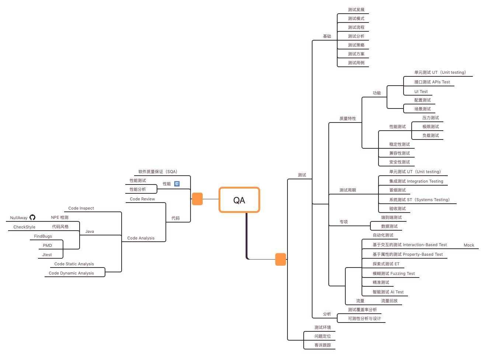

# KS-QA

QA
=================

   * [<a href="_pic/QA-capacity-model.png">QA 能力模型</a>](#qa-能力模型)
   * [<a href="SQA/README.md">软件质量保证</a>](#软件质量保证)
      * [<a href="SQA/Quality/README.md">质量</a>](#质量)
   * [测试](#测试)
      * [<a href="Testing/Basic/README.md">测试基础</a>](#测试基础)
         * [<a href="Testing/Basic/README.md">测试原则</a>](#测试原则)
         * [<a href="Testing/Basic/README.md">测试策略</a>](#测试策略)
         * [<a href="Testing/Basic/README.md">测试用例</a>](#测试用例)
      * [<a href="Testing/UnitTest/README.md">单元测试(Unit Testing)</a>](#单元测试unit-testing)
         * [Java](#java)
            * [<a href="Testing/UnitTest/Java/Spock/README.md">Spock</a>](#spock)
            * [JUnit](#junit)
            * [TestNG](#testng)
            * [Mockito](#mockito)
      * [<a href="Testing/APIsTest/README.md">接口测试(APIs Testing)</a>](#接口测试apis-testing)
      * [<a href="Testing/EndToEnd-Test/README.md">端到端测试(End-to-End Testing)</a>](#端到端测试end-to-end-testing)
      * [<a href="Testing/DataTest/README.md">数据测试</a>](#数据测试)
      * [配置测试](#配置测试)
      * [<a href="ET/README.md">Exploratory Test （探索式测试 ET）</a>](#exploratory-test-探索式测试-et)
      * [<a href="">基于交互的测试(Interaction-Based Testing)</a>](#基于交互的测试interaction-based-testing)
         * [<a href="Testing/InteractionBasedTest/Mock/README.md">Mock</a>](#mock)
      * [<a href="Testing/PropertyBasedTest/README.md">基于属性的测试(Property-Based Testing)</a>](#基于属性的测试property-based-testing)
      * [模糊测试](#模糊测试)
      * [<a href="Testing/AITest/README.md">智能测试(AI Testing)</a>](#智能测试ai-testing)
      * [精准测试](#精准测试)
      * [<a href="Testing/Analysis/README.md">测试分析</a>](#测试分析)
         * [<a href="code-coverage/README.md">代码覆盖率分析（Code Coverage</a>](#代码覆盖率分析code-coverage)
   * [<a href="CodeReview/CR/README.md">代码评审（Code Review)</a>](#代码评审code-review)
   * [<a href="CodeAnalysis/README.md">代码分析（Code Analysis）</a>](#代码分析code-analysis)
      * [<a href="CodeAnalysis/CodeInspect/README.md">代码检查（Code Inspect）</a>](#代码检查code-inspect)
      * [<a href="CodeAnalysis/StaticAnalysis/README.md">静态代码检查(Code Static Analysis)</a>](#静态代码检查code-static-analysis)
      * [<a href="CodeAnalysis/Java/README.md">Java 代码分析</a>](#java-代码分析)
   * [性能](#性能)
      * [<a href="Perf/PerfTest/README.md">Performance Test</a>](#performance-test)
      * [<a href="Perf/Profile/README.md">Performance Profile</a>](#performance-profile)
         * [<a href="Perf/Profile/Linux/README.md">Linux</a>](#linux)
   * [Reference](#reference)
      * [<a href="https://www.cnblogs.com/kenfang/articles/4307935.html" rel="nofollow">软件测试中英文词汇汇总表</a>](#软件测试中英文词汇汇总表)
      * [<a href="http://www.51testing.com/html/12/480312-814448.html" rel="nofollow">软件测试中一般术语的英文和缩写</a>](#软件测试中一般术语的英文和缩写)
   * [Resource](#resource)
      * [<a href="https://github.com/didi/rdebug">RDebug - Real Debugger (流量复制和回放框架)</a>](#rdebug---real-debugger-流量复制和回放框架)

